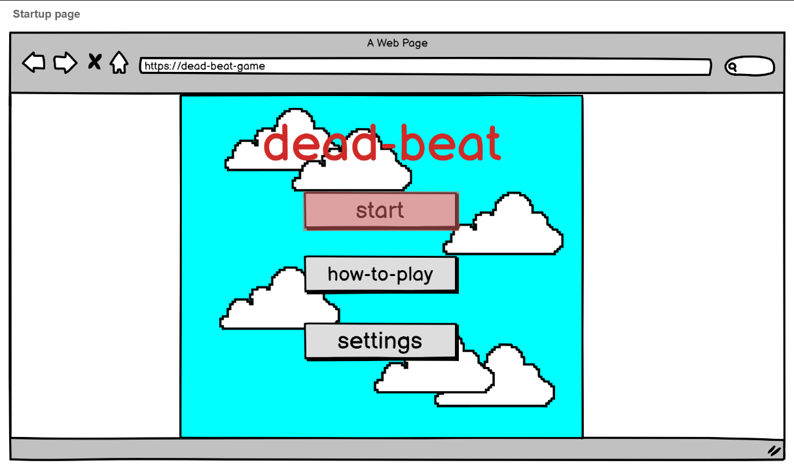
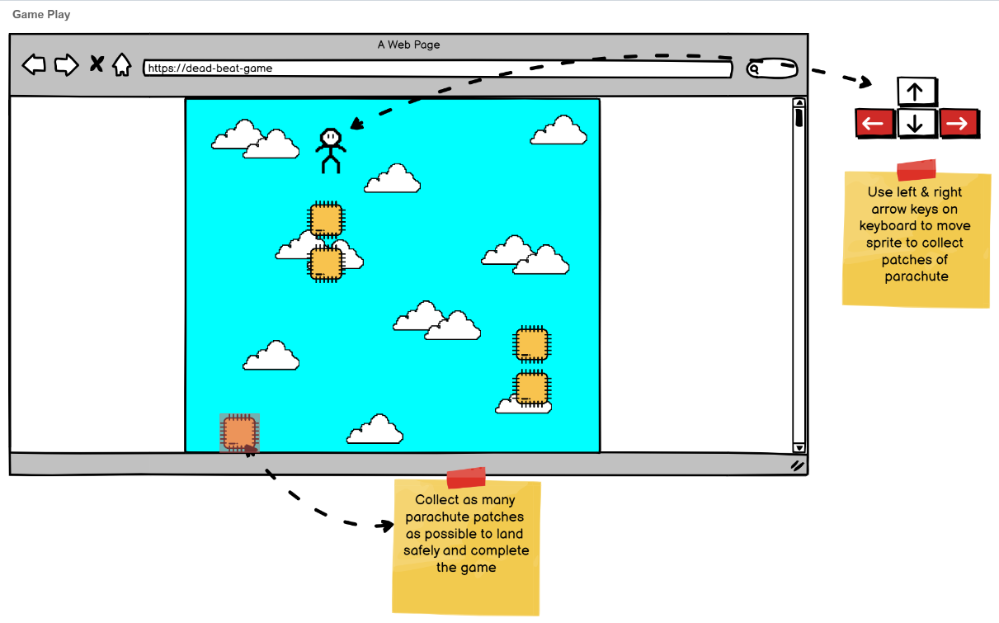
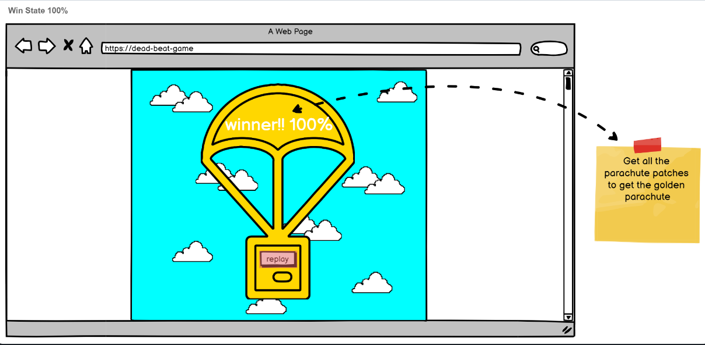

# **Dead-beat**
## *Help! Our dead-beat sprite is on a rhythm fuelled collision course with the earth. Move dead-beat to the groove of the music, and catch as many parachute material patches as he falls through the rhythm of the sky, will you collect enough to make a parachute*

## Wireframes for the game

## Technologies Used

- HTML5
- Javascript
- Phaser.js

## How to play

* Arrow keys - move left and right
* Spacebar - Collect parachute material
* Collect enough patches to survive
* Don't miss any notes to earn a multiplier and get a high score

## Features

- Collect parachute patches to the beat, get enough and survive
- Collecting patches earns points & increases score multiplier
- Missing patches resets your multiplier
- Beat pattern matches the song including lining up with certain instruments, multiple playthroughs are needed to learn the song (replay-value)
- Patches can appear as 1 beat, 1/2 beat, or 1/4beat
- Movement intially feels decoupled from the beat, but can be aligned to the music too, to get the FLOW STATE!
- Includes a variable BMP and the ability to split each beat into multiple notes for future songs
- Beats collected and score are decoupled, allowing an inexperienced player a chance at winning, and a pro player a focus on high score.
- Collecting every patch in one attempt grants you a perfect victory screen!
- No load screens keep the player in the zone and game can quickly be restarted for another go
    - Title Screen
    - Game Screen
    - Win Screen
    - Lose Screen

### Deployed link

[Click here to play!](https://debbiect246.github.io/dead-beat/)

### Development Changes

* Being a simple game, the Settings and how to play options were not needed, all information was included in the title screen.

### Future Development

* Obstacles that remove multiplier if hit
* Star scoring system on win screen
* Parachute guy lands on a win

## Credits

* [freepik](https://www.freepik.com/search?color=orange&format=search&query=patches&type=icon)
* [freeSFX](https://freesfx.co.uk/)
* [Music](https://soundcloud.com/alexproductionsmusic/energetic-rock-vlog-music-by-efficsounds-alex-productions-free-music-hiking-free-music)

## Linked in details of team members
* [Kelvin Ward](https://www.linkedin.com/in/kelvinhere/)
* [Shaun Buck](https://www.linkedin.com/in/shaun-buck-749093221/)
* [Debbie Thompson](//www.linkedin.com/in/debbie-thompson-1baa4733/)
* [Cameron Cove-Crichton](https://www.linkedin.com/in/cameron-cove-crichton-8aa332198/)

